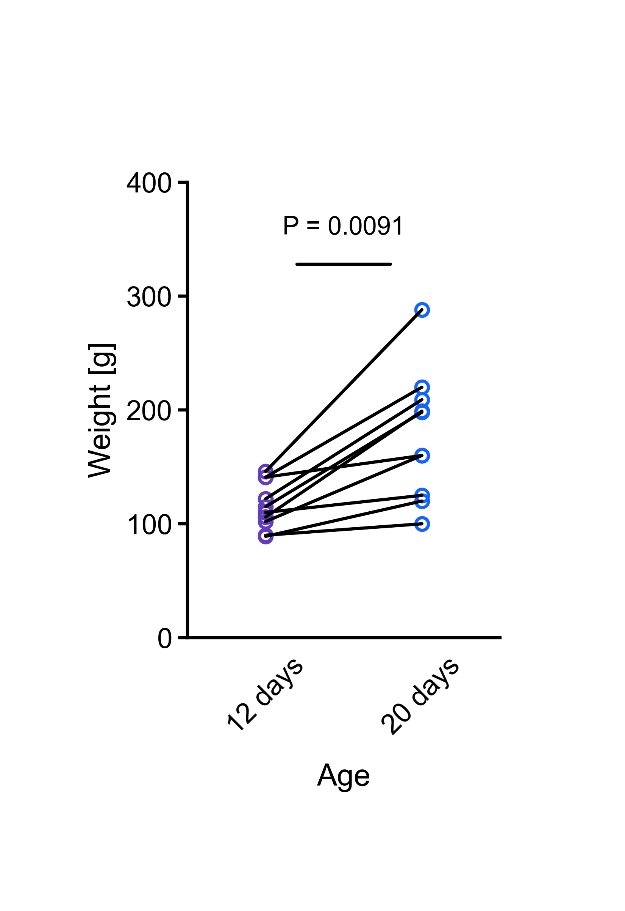

# Paired Plot
Script to generate a paired plot. The chick weight dataset (Crowder & Hand, 1990) including weight units ([Roberts, 1964](https://doi.org/10.3382/ps.0430238); [Knížetová et al, 1991](https://doi.org/10.1080/00071669108417427)) is used for demonstration.

installation:

```bash
pip install -r requirements.txt
```

usage:

```bash
python paired_plot.py
```



Cite As

[Nzakimuena, C. B., Solano, M. M., Marcotte-Collard, R., Lesk, M. R., & Costantino, S. (2025). Spatial and temporal changes in choroid morphology associated with long-duration spaceflight. Investigative Ophthalmology & Visual Science, 66(5), 17-17.](https://doi.org/10.1167/iovs.66.5.17)

### References

1. Crowder, M. J., & Hand, D. J. (1990). Analysis of repeated measures (Vol. 41). CRC Press.
1. [Roberts, C. W. (1964). Estimation of early growth rate in the chicken. Poultry Science, 43(1), 238-252.](https://doi.org/10.3382/ps.0430238)
1. [Knížetová, H., Hyanek, J., Kníže, B., & Roubíček, J. (1991). Analysis of growth curves of fowl. I. Chickens. British Poultry Science, 32(5), 1027-1038.](https://doi.org/10.1080/00071669108417427)
